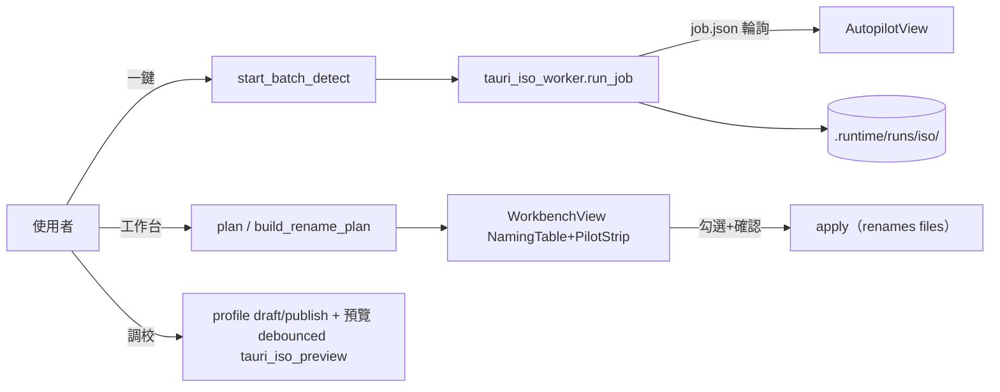
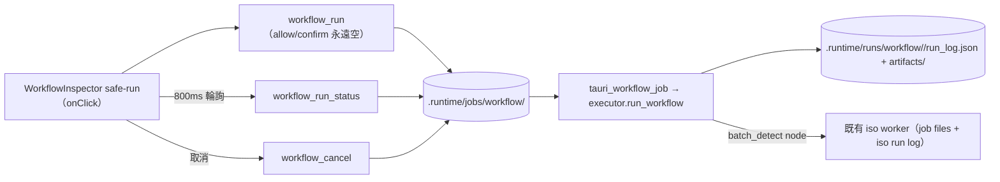
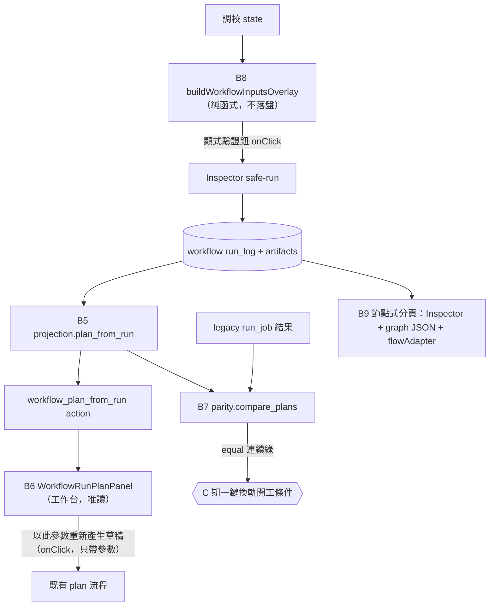

# ISO Node Workflow — Consumption & Parity Stage 施工書（B5-B9）

> Date: 2026-06-10
> Base: `codex/tauri-react-spike` @ `74e6ad9`（merge(iso-workflow): bridge B1-B4 into tauri spike）
> 前篇：`docs/iso_pdf_workflow_bridge_phase_plan_2026-06-10.md`（B 期前半，已完成、封存）
> 母文件：`docs/iso_pdf_node_workflow_codex_handoff_2026-06-10.md`（engine 規格仍有效；§15.6「B4 完成即停工待命」自本文件起解除，本文件是新的唯一 active 施工入口）
> 本文件所有型別名、函式名、檔名都對照 `74e6ad9` 的實碼驗證過，照抄即可。

---

# A. 現況判斷

## A.1 B1-B4 之後，系統實際擁有的能力

**Backend（`launcher/app/tauri_iso_workflow.py`，現共 29 個 action）**

| 群組 | actions | 狀態 |
|---|---|---|
| 既有 ISO（凍結） | 21 個（plan/apply/batch detect/profile/run log…） | 未動，回歸 19 tests 綠 |
| Workflow 唯讀（B0） | `workflow_list_nodes` / `workflow_load` / `workflow_validate` | 可用 |
| Workflow 執行（B2） | `workflow_run` / `workflow_run_status` / `workflow_cancel` / `workflow_list_runs` / `workflow_read_run_log` | 可用；job dir + polling（`launcher/app/tauri_workflow_job.py`），cancel 鏈通到 batch_detect 內層 iso job |

`IsoWorkflowRequest` 已有 append-only 欄位：`workflow_path` / `workflow` / `workflow_inputs` / `workflow_allow` / `workflow_confirm` / `workflow_mode` / `workflow_job_id` / `workflow_run_id`。

**Run log 與 artifacts（`launcher/plugins/iso_tools/workflow/run_log.py` + `context.py`）**

- `runtime_root()/.runtime/runs/workflow/<run_id>/`：`run_log.json`（含 `nodes`、`topology`、`inputs`、`workflow`、`graph_hash`、`policy`、`side_effect_summary`）、`graph.snapshot.json`、`inputs.json`、`events.jsonl`、`artifacts/<node>.<port>.json`。
- ArtifactRef = `{"artifact_ref", "bytes", "sha256", "inline"(≤2KB 才有)}`。**關鍵限制：rows/result 這類大 artifact 沒有 inline，前端拿 `workflow_read_run_log` 只能看到 ref，看不到內容**——這就是 B5 要補的洞。
- batch_detect node 的 outputs ports：`rows`、`result`（plan 形狀）、`job`、`iso_run_log`（public_run_ref，連回既有 ISO run log）。

**Frontend（`frontend/tauri-spike/src/`）**

- `iso/IsoBoard.tsx`：`isoView` 三分頁 `"autopilot" | "workbench" | "engineer"`；分頁元件已拆出 `AutopilotView.tsx` / `WorkbenchView.tsx` / `EngineerView.tsx`。
- `iso/WorkflowInspector.tsx`（1050 行）：掛在 engineer 分頁內（IsoBoard L1467），有節點型錄、圖檢視、run 歷史、safe-run + 800ms polling + cancel。
- `isoWorkflow.ts`：workflow 型別齊全（`IsoNodeWorkflowGraph/Spec/RunSummary/RunLog/JobPayload`…）+ helpers（`listIsoWorkflowNodes` / `loadIsoNodeWorkflow` / `validateIsoNodeWorkflow` / `listIsoWorkflowRuns` / `readIsoWorkflowRunLog` / `runIsoNodeWorkflowSafe`（**簽名無 allow/confirm，安全邊界成立**）/ `loadIsoWorkflowJobStatus` / `cancelIsoWorkflowJob`）。
- **B8 的種子已存在**：IsoBoard L1311-1323 的 `workflowInspectorInputs` useMemo 已把調校 11 個欄位（work_folder/combine_pdf/iso_list/sheet_name/serial_col/line_col/pattern/detect_serials/confidence_threshold/serial_region/drawing_region）映射成 workflow inputs 傳給 Inspector。B8 不是從零做 overlay，是把這個 memo 正式化。

## A.2 看得到、但還不能當主流程的能力

1. **workflow run 的結果是孤島**：rows/pilot 只活在 Inspector 的 job result 摘要裡；工作台的 NamingTable/PilotStrip 完全看不到 workflow run。沒有 run → plan 的投影。
2. **沒有等價證明**：safe POC 跑出來的 rows/summary/pilot 和一鍵（start_batch_detect 路徑）之間，從未被機器逐欄比對過。一鍵換軌在此之前都不准動。
3. **調校參數與 workflow inputs 的對應只是 implicit memo**：沒有欄位分類文件、沒有 vs profile 的 diff 顯示、沒有「以節點流程驗證」的正式入口。
4. **節點式還不是身份**：Inspector 寄居在調校分頁尾端，四模式架構（一鍵/工作台/調校/節點式）的第四格還是空的。

## A.3 已過期、需要本階段更新的文件與邊界

| 過期項 | 處置 |
|---|---|
| bridge plan §C「B5 預告…Codex 做完 B4 必須停下」與母文件 §15.6 同句 | 本文件即是「下一份施工書」，停工令解除；兩份舊文件**不改字**，以本文件為新入口（B5 commit 將本文件入庫即生效） |
| 母文件 §12.2 future actions 表 | 前 3 列 + run/status/cancel 已實作；本階段再消化 `workflow_read_artifact`、`workflow_plan_from_run`（§E 定義）；其餘維持未來式 |
| bridge plan §E.7「Inspector 永遠在調校 > 進階」 | B9 把 Inspector 升格為第四分頁「節點式」，調校留跳轉鈕（屬 bound 更新，非違規） |
| `IsoWorkflowPlan["action"]` union（isoWorkflow.ts L364 附近） | B6 append `"workflow_plan_from_run"` 字面值 |

---

# B. 下一階段總目標

**一句話**：把 workflow run 從「跑得動、看得到」升級成「工作台可唯讀消費、調校可顯式驗證、與舊一鍵路徑有機器證明的等價性」的可信資料源——一鍵換軌與節點畫布仍然一行都不動。

**做到哪裡停**：B9 結束（節點式分頁 + flow adapter 資料模型落地）即停工，merge 回 `codex/tauri-react-spike` 後等下一份施工書（C 期：一鍵 parity 換軌 + React Flow 畫布）。

**本階段不做什麼**：

- 不改一鍵執行路徑（`AutopilotView` 與其 batch detect 流程零行為變更）。
- 不裝 React Flow / LiteGraph / Rete.js，不畫 canvas（B9 只做資料模型 adapter）。
- 前端仍不得出現任何傳 `workflow_allow` / `workflow_confirm` 的程式路徑；真 rename / writes_profile 只有 CLI 三因子。
- replay 對 `renames_files` / `writes_profile` 的引擎層 + action 層硬封鎖不放寬。
- 不新增 side-effect kind、不包 publish/revert profile node、不動 PyQt legacy。
- `useEffect` / `onChange` / polling callback 內不得呼叫 `workflow_run`、`start_batch_detect` 或任何 OCR；執行一律來自使用者點擊（polling 唯讀 status 除外）。
- 工作台匯入的 workflow rows **永不接 apply**——要動檔案，必須經「以此參數重新產生草稿」走既有 plan 流程。


---

# C. Phase 拆分（B5-B9）

> 通則：每 phase 一個 commit + push；B5 / B7 是 backend-only 🟢 checkpoint，可隨時停下交接。B6/B8/B9 各自獨立、可單獨 revert。施工分支：`codex/iso-workflow-consume`（見 G 的 pre-flight）。

## Phase B5 — Run→Plan 投影與 artifact 讀取（backend only）🟢

- **目標**：任何一筆 workflow run 都能被投影成既有 `IsoWorkflowPlan` 形狀的 payload（rows/summary/pilot/issues/source 齊全），且任一 artifact 可被安全讀取。這是 B6（工作台）、B7（parity）、B8（調校結果檢視）三者共用的地基。
- **修改檔案清單**：
  - 新增 `launcher/plugins/iso_tools/workflow/projection.py`
  - 修改 `launcher/app/tauri_iso_workflow.py`（`_dispatch_request` 尾端 append 兩個 action：`workflow_plan_from_run`、`workflow_read_artifact`；handler 內 lazy import projection）
  - 新增 `tests/test_iso_workflow_projection.py`；`tests/test_tauri_iso_workflow.py` append 兩個 action 的測試
- **projection.py 規格（照抄）**：
  ```python
  def read_artifact(run_dir: Path, node_id: str, port: str) -> tuple[dict, Any]:
      """回傳 (ref_meta, payload)。
      安全規則：node_id/port 必須存在於 run_log.json 的 nodes[node_id].outputs[port]，
      路徑一律由 run_log 內的 artifact_ref 拼 run_dir 而來，且 resolve 後必須仍在 run_dir 下
      （防 traversal）。payload 檔案上限 64MB，超過丟 ValueError。"""

  def plan_from_run(run_dir: Path) -> dict[str, Any]:
      """投影規則（依序）：
      1. base = batch_detect 節點的 `result` artifact（worker 的 _result_payload 本來就是
         plan 形狀，action="batch_detect_result"）。若 run 裡沒有 batch_detect 或其
         status != success，fallback 找 node_type=="iso.build_plan" 的 `plan` artifact。
         兩者皆無 → raise ValueError("此 run 沒有可投影的 plan 輸出。")
      2. rows = base["rows"]；若空則讀 batch_detect 的 `rows` artifact 補。
      3. pilot_results：優先用 node_type=="iso.pilot_report" 節點的 `pilot_results`
         artifact（比 base 內嵌版新鮮）；沒有才留 base 內嵌值。
      4. summary 一律用 rows 重算（呼叫 tauri_iso_workflow._summary，不信舊值——
         循環 import 風險：projection 不 import tauri_iso_workflow，改為把
         _summary 的 5 行邏輯複製為 projection._summary_from_rows 並加註來源）。
      5. action 改寫為 "workflow_plan_from_run"；附 provenance（見 §E.1）。
      6. 不改寫 rows 內任何欄位；selected 維持 run 當下的值。"""
  ```
- **action 規格**：
  - `workflow_plan_from_run`：request 用既有欄位 `workflow_run_id`（必填）；response = 投影後 plan payload（`IsoWorkflowPlan` 形狀 + `provenance`）。
  - `workflow_read_artifact`：request `workflow_run_id` + 新 append-only 欄位 `workflow_node_id: str | None`、`workflow_port: str | None`（兩者必填於此 action）；response `{schema_version, action, created_at, run_id, node_id, port, ref, payload}`。
- **禁止**：不動 executor/run_log/nodes 任何既有檔；projection 零 `launcher.app` import（維持引擎套件無 app 依賴的守門測試）；不在 action 層快取。
- **驗收標準**：
  1. 投影測試：用 FakeNode + 手造 artifacts 的 run dir 驗 fallback 鏈、pilot 覆蓋、summary 重算、provenance 欄位齊全。
  2. 端到端：fixtures（pypdf+openpyxl、detect_serials=false、monkeypatch `_spawn_iso_worker`→同步 `run_job`）跑 safe POC → `plan_from_run` 的 rows 與 legacy 直跑 `build_iso_plan(page_folder=...)` 等值（page/source_name/serial/line_no/new_name/status 逐欄）。
  3. 安全：偽造 node_id / port / `..` 路徑 → ValueError；>64MB → ValueError。
  4. 既有 47 + 19 測試全綠。
- **測試命令**：
  ```powershell
  & .venv\Scripts\python.exe -m pytest tests\test_iso_workflow_projection.py tests\test_tauri_iso_workflow.py -q
  # pytest 不可用： & .venv\Scripts\python.exe -m unittest tests.test_iso_workflow_projection -v
  ```
- **Checkpoint**：🟢 backend 自足，可停下交接。
- **Commit**：`feat(iso-workflow): project workflow runs into plan payloads (B5)`
- **Rollback 風險**：純新增 + dispatcher 尾端兩行；revert 單 commit 即回原狀，無資料遷移。

## Phase B6 — 工作台唯讀消費 workflow run（frontend）

- **目標**：工作台多一個預設收合的「節點流程結果（唯讀）」面板：挑 run → 看 rows/summary/pilot/issues/side-effect 證據；要採取行動只能按「以此參數重新產生草稿」走既有 plan 流程。
- **修改檔案清單**：
  - 修改 `frontend/tauri-spike/src/isoWorkflow.ts`（append：`IsoWorkflowPlan["action"]` union 加 `"workflow_plan_from_run"`；新增 `IsoWorkflowPlanProvenance` 介面與 `provenance?` 欄位；helpers `loadIsoWorkflowPlanFromRun(runId)`、`readIsoWorkflowArtifact(runId, nodeId, port)`）
  - 新增 `frontend/tauri-spike/src/iso/components/WorkflowRunPlanPanel.tsx`（自足元件：run 下拉（`listIsoWorkflowRuns`，顯示 run_id/status/started_at/mode）→ 載入投影 → 摘要 chips（ready/warn/blocked 計數）→ `PilotStrip`（view="workbench"）→ 唯讀列表 → provenance 條（run_id、graph_hash 前 8 碼、iso_run_log run_id 連到 `openRunLogDrawer`）→ side_effect_summary 三色列）
  - 修改 `frontend/tauri-spike/src/iso/components/NamingTable.tsx`（append-only：`readOnly?: boolean` prop，預設 false；true 時 checkbox/編輯 callback 全部 no-op + 滑鼠樣式 default。若實作後發現要改超過 ~30 行，放棄共用，改在 Panel 內做 60 行內的純顯示表格——二擇一，做完在 commit message 註明選了哪條）
  - 修改 `frontend/tauri-spike/src/iso/WorkbenchView.tsx`（尾端 mount `<WorkflowRunPlanPanel openRunLogDrawer={...} onAdoptParams={...} />`，collapsible、預設收合）
  - 修改 `frontend/tauri-spike/src/iso/IsoBoard.tsx`（僅傳 props：`onAdoptParams` 把投影的 `source` 欄位寫回既有受控 state（workFolder/combinePdf/isoList/sheetName/serialCol/lineCol/pattern/confidenceThreshold/serialRegion/drawingRegion），**不自動觸發 plan**，只 setMessage 提示「參數已帶入，請按產生草稿」）
- **禁止**：匯入 rows 不得寫入工作台現行 plan/rows state（apply 永遠碰不到它們）；不加 npm 套件；不動 AutopilotView/EngineerView；`onAdoptParams` 不得連鎖呼叫 `runIsoPlan`。
- **驗收標準**：
  1. `npx tsc --noEmit` 0 錯、`npm run build` 過。
  2. 預設收合時工作台 DOM 與行為與 B5 前等價（一鍵/調校 git diff = 0）。
  3. 手動煙測一次（非逐步人工：跑 fixtures 產生一筆 run 後，面板能列出並展開該 run，rows 與 Pilot 正常顯示，「重新產生草稿」帶入參數但不自動跑）。
  4. grep 驗證：`WorkflowRunPlanPanel.tsx` 內無 `applyIsoPlan`、無 `workflow_run`、無 `start_batch_detect` 字串。
- **測試命令**：
  ```powershell
  cd frontend\tauri-spike; npx tsc --noEmit; npm run build
  Select-String -Path src\iso\components\WorkflowRunPlanPanel.tsx -Pattern "applyIsoPlan|workflow_run|start_batch_detect"   # 期望 0 筆
  ```
- **Checkpoint**：可停（工作台已能看，調校/parity 未動）。
- **Commit**：`feat(iso-workflow): readonly workflow run panel in workbench (B6)`
- **Rollback 風險**：新元件 + 四檔小改；revert 後工作台回 B5 前狀態。NamingTable 若選了 readOnly prop 路線，revert 連動該 prop（無其他呼叫點，安全）。


## Phase B7 — 一鍵 parity 換軌前置：等價測試 harness（backend only）🟢

- **目標**：建立機器可重複執行的等價證明：同一份輸入，legacy 路徑（`start_batch_detect`→worker `run_job`，即一鍵實際走的路）與 workflow safe POC 路徑的 rows/summary/pilot 必須等價。從此「一鍵能不能換軌」是一條測試指令的事，不是感覺。
- **修改檔案清單**：
  - 新增 `launcher/plugins/iso_tools/workflow/parity.py`
  - 修改 `launcher/plugins/iso_tools/workflow/cli.py`（append 子命令 `parity`）
  - 新增 `tests/test_iso_workflow_parity.py`
- **parity.py 規格**：
  ```python
  @dataclass
  class ParityReport:
      equal: bool
      acceptable_diffs: list[dict]    # 被正規化吸收的差異（審計用）
      violations: list[dict]          # {"field", "legacy", "workflow", "row_page"?}
      legacy_digest: str; workflow_digest: str
      def to_payload(self) -> dict: ...

  def normalize_plan_payload(payload: dict) -> dict:
      """正規化（= 可接受差異的白名單，逐條實作）：
      - 移除：created_at、run_log、job 區塊、export 相關欄位、steps（文案性質）
      - source：移除 iso_candidates / sheet_options / profile（環境相依）；
        work_folder/combine_pdf/page_folder/iso_list 只留 basename
      - rows：依 page 排序；每列只留 {page, source_name, serial, line_no, new_name,
        status, selected, confidence(round 6), note 是否為空}；source_path/target_path
        只比 basename；id 不比（row-N vs r-N 命名差異屬可接受）
      - issues：只比 code 的 multiset，不比順序與 detail
      - pilot_results：每項只留 {id, status, blocks_apply}；P15(draft_freshness) 的
        status 排除嚴格比對（兩邊執行時間差會影響 freshness），但仍要求兩邊都存在 P15
      - summary：原樣保留（必比）"""

  def compare_plans(legacy: dict, workflow_projected: dict) -> ParityReport: ...

  def run_parity(inputs: dict, *, workflow_path: Path, work_dir: Path) -> ParityReport:
      """1) legacy 側：用 start_batch_detect 的同款 payload 手動建 job dir——
         直接呼叫 tauri_iso_workflow 的 _initial_job_payload/_write_json 寫
         job.json + request.json（不 spawn），再 in-process 呼叫
         tauri_iso_worker.run_job(job_dir) 取 result（這正是一鍵 spawn 之後做的事，
         決定性且無子程序競態）。
      2) workflow 側：executor.run_workflow(safe POC graph, inputs)（in-process），
         再用 projection.plan_from_run 投影。
      3) 兩邊 normalize 後 compare。
      註：parity.py 允許 import launcher.app（它是測試 harness，不是引擎）；
      但 engine 模組守門測試不變。"""
  ```
- **不可接受差異（violations，任一出現即 fail）**：rows 筆數；任一列的 page/source_name/serial/line_no/new_name/status/selected；summary 各計數；pilot P01-P14 的 {id, status, blocks_apply}；blocked 列集合。
- **可接受差異（吸收進 normalize，並記進 acceptable_diffs）**：時間戳、run/job id、絕對路徑前綴、issues 順序與文案、steps、profile/candidates 環境欄位、row id 命名、P15 status、confidence 第 7 位以後浮點差。
- **CLI**：`python -m launcher.plugins.iso_tools.workflow.cli parity --inputs-json F [--workflow PATH=safe_poc] [--report-out PATH] [--json]`；exit 0=equal、6=violations（新 exit code，文件化）、2=輸入錯。report JSON 預設寫 `.runtime/temp/parity_report_<ts>.json`。
- **測試矩陣（test_iso_workflow_parity.py）**：
  1. golden fixture：生成 3 頁 PDF + 3 列 ISO 表、`detect_serials=false` → `report.equal is True`。
  2. smoke fixture（含偵測路徑）：`detect_serials=true` + monkeypatch `_SerialDetector` 為決定性 stub（比照既有 `SerialVisionResult` patch 手法）→ equal。
  3. 變異哨兵：故意竄改 workflow 投影的一列 serial → `equal is False` 且 violation 指認到該列（證明 harness 不是永遠回 True 的安慰劑）。
  4. real sample（optional）：`@unittest.skipUnless(Path("C:/Users/a0976/Downloads/t").exists(), ...)` 跑真樣本，斷言 equal；CI/無樣本環境自動跳過。
- **禁止**：不為了讓 parity 過而改 legacy 或 workflow 任一側的業務行為（發現真差異 → 停下，把 violation 報告原文記進 commit message / 工作筆記，等裁決——**這是本 phase 唯一允許的「先停」情境**）。
- **驗收標準**：四個測試類別綠（或 4 在無樣本環境 skip）；CLI parity 在 fixtures 上 exit 0；變異哨兵證明有效。
- **測試命令**：
  ```powershell
  & .venv\Scripts\python.exe -m pytest tests\test_iso_workflow_parity.py -q
  & .venv\Scripts\python.exe -m launcher.plugins.iso_tools.workflow.cli parity --inputs-json .runtime\temp\poc_inputs.json --json
  ```
- **Checkpoint**：🟢 可停（從此一鍵換軌有守門員；C 期開工條件 = 本測試連續綠）。
- **Commit**：`feat(iso-workflow): add legacy-vs-workflow parity harness (B7)`
- **Rollback 風險**：純新增（cli.py 一個子命令）；revert 無副作用。最大風險是「parity 揭露真實差異」——那不是 rollback 情境，是本 phase 的價值所在。

## Phase B8 — 調校 inputs overlay 正式化 + 顯式驗證（frontend 為主）

- **目標**：把 IsoBoard 既有的 `workflowInspectorInputs` memo 升格為正式的「調校 overlay」：有欄位分類、有 vs 設定檔 diff、有一顆顯式的「以節點流程驗證目前調校」按鈕，結果用 B6 的投影面板呈現。OCR 重跑災難從規則層面封死。
- **欄位分類（定案，寫進 helpers 註解與本文件）**：
  | 類別 | 欄位 | 歸屬 |
  |---|---|---|
  | workflow_inputs（資料源 + 調校參數） | work_folder, combine_pdf, iso_list, sheet_name, serial_col, line_col, pattern, detect_serials, confidence_threshold, serial_region, drawing_region | 調校 overlay 的全部；與 safe POC `inputs` 區塊一一對應 |
  | node params（引擎行為旋鈕） | wait_for_completion, poll_interval_ms, timeout_s, only_ready, dry_run, as_rename_plan | **本階段不開放 UI 編輯**；維持圖內預設。params overlay 留給 C 期節點式編輯 |
- **修改檔案清單**：
  - 修改 `frontend/tauri-spike/src/iso/helpers.ts`（新增純函式 `buildWorkflowInputsOverlay(state): Record<string, unknown>`——把 IsoBoard L1311-1323 的 memo 內容搬進來成為單一事實來源；新增 `diffOverlayAgainstProfile(overlay, profile): OverlayDiffEntry[]`）
  - 修改 `frontend/tauri-spike/src/iso/IsoBoard.tsx`（`workflowInspectorInputs` memo 改為呼叫 `buildWorkflowInputsOverlay`；不增任何自動執行）
  - 修改 `frontend/tauri-spike/src/iso/EngineerView.tsx`（加一顆「以節點流程驗證目前調校」按鈕（onClick → 捲動/展開 Inspector 的 run 區塊並觸發其既有 safe-run 入口）+ overlay diff 卡片：列出與已發布 profile 不同的欄位（欄名、profile 值、目前值））
  - 修改 `frontend/tauri-spike/src/iso/WorkflowInspector.tsx`（run 結果區尾端 append「以投影檢視」連結：run 完成後用 `loadIsoWorkflowPlanFromRun` 顯示 `WorkflowRunPlanPanel`（B6 元件複用，傳入固定 runId））
- **Debounce / draft / explicit run 安全規則（不可違反）**：
  1. ROI slider / 信心滑桿 / 欄位輸入 → 只更新本地受控 state；單頁預覽繼續走既有 debounced `tauri_iso_preview`（commit `15cf898` 行為不動）。
  2. overlay 是**衍生值**（隨 state 即時重算的純函式），不落盤、不自動送後端；持久化唯一路徑 = 既有 `saveIsoDraftProfile`（草稿）→ `publishIsoProfile`（發布，沿用既有治理）。
  3. workflow 執行只有兩個入口且都是 onClick：Inspector 既有 run 鈕、EngineerView 新驗證鈕（後者實際 delegate 前者，不另開第二條 `runIsoNodeWorkflowSafe` 呼叫鏈）。
  4. 參數變更永不 invalidate / 自動重跑任何 run；最多顯示「參數已變更，結果可能過期」徽章（純顯示）。
- **禁止**：不新增 backend action；不動 `workflow/` Python 套件；不把 node params 做成 UI；不在任何 useEffect 依賴 overlay 觸發執行。
- **驗收標準**：
  1. tsc/build 綠；既有 19 backend action 測試綠（backend 零 diff 用 `git diff --stat` 證明）。
  2. grep 驗證：`runIsoNodeWorkflowSafe` 在 `src/` 的呼叫點恰好 1 處（WorkflowInspector 內的 onClick handler）；`useEffect` 區塊內 0 處。
  3. 手動煙測一次：拖 ROI slider 連續 20 下 → DevTools network/console 無任何 workflow_run / batch_detect 呼叫；按驗證鈕 → 跑一次 → 投影面板顯示結果。
  4. overlay diff 卡片對「pattern 改掉、threshold 改掉」正確列出 2 筆差異。
- **測試命令**：
  ```powershell
  cd frontend\tauri-spike; npx tsc --noEmit; npm run build
  Select-String -Path src -Pattern "runIsoNodeWorkflowSafe" -Recurse   # 期望恰 1 個呼叫點 + import 行
  git diff --stat -- launcher tests   # 期望空
  ```
- **Checkpoint**：可停（調校已可顯式驗證；節點式分頁未動）。
- **Commit**：`feat(iso-workflow): formalize tuning inputs overlay with explicit verify run (B8)`
- **Rollback 風險**：helpers 抽取是搬移既有邏輯，revert 會連帶退回 memo 寫法（無資料風險）；EngineerView 按鈕純增量。


## Phase B9 — 「節點式」第四分頁 + flow adapter 資料模型（frontend）

- **目標**：四模式補上第四格：`isoView` 增加 `"nodes"`，把 WorkflowInspector 從調校尾端**搬家**成獨立「節點式」分頁，加上 graph JSON 原文檢視；同時落地 React Flow 相容的資料模型 adapter（純 TS、零新 runtime 依賴），為 C 期畫布鋪軌。
- **畫布選型裁決（C 期才裝，本期只記錄理由）**：**React Flow（@xyflow/react v12）**。理由：(1) repo 是 React 18 + Vite + TS，React Flow 是唯一以 React 受控元件為一等公民的選項，graph JSON ↔ `nodes[]/edges[]` 幾乎 1:1；(2) 自訂 node 渲染（guarded 紅鎖、disabled 灰顯、side-effect chips）就是寫 React 元件，沿用現有樣式；(3) MIT、活躍維護、文件完整。LiteGraph 淘汰：imperative canvas + 自帶執行引擎（與我們的 Python executor 職責衝突）+ TS/React 整合差。Rete.js 淘汰：plugin 架構過重，為了渲染一張唯讀圖引入太多框架概念。**本期絕不執行 `npm install @xyflow/react`。**
- **修改檔案清單**：
  - 修改 `frontend/tauri-spike/src/iso/IsoBoard.tsx`（`isoView` union 加 `"nodes"`；分頁列加第四鈕「節點式」（title：節點式：graph / run log / 進階檢視）；`isoView === "nodes"` 分支渲染 `<WorkflowInspector workflowInputs={workflowInspectorInputs} />`；engineer 分支移除 Inspector mount）
  - 修改 `frontend/tauri-spike/src/iso/EngineerView.tsx`（原 Inspector 位置改為一行跳轉鈕「進階檢視已移至『節點式』分頁 →」onClick 呼叫傳入的 `onOpenNodesView`）
  - 修改 `frontend/tauri-spike/src/iso/WorkflowInspector.tsx`（append：graph JSON 原文 `<details>` 區塊（`JSON.stringify(graph.graph, null, 2)`，含複製鈕）；DEV 模式掛 adapter 自檢（見下））
  - 新增 `frontend/tauri-spike/src/iso/flowAdapter.ts`（純函式 + 本地型別，**不 import 任何新套件**）：
    ```ts
    // 結構相容 @xyflow/react 的 Node/Edge，先以本地型別定義
    export interface FlowNodeData { nodeType: string; displayName: string; enabled: boolean;
      guarded: boolean; requiresConfirm: boolean; sideEffects: string[]; params: Record<string, unknown>; }
    export interface FlowNode { id: string; position: { x: number; y: number }; data: FlowNodeData; type: "isoNode"; }
    export interface FlowEdge { id: string; source: string; target: string;
      sourceHandle: string; targetHandle: string; }
    export function graphToFlow(payload: IsoNodeWorkflowValidationPayload):
      { nodes: FlowNode[]; edges: FlowEdge[] }
    // 佈局：用 payload.topology 分層（layer = 最長上游距離），x = layer*280, y = 層內序*120
    export function flowToGraphPatch(nodes: FlowNode[]): Array<{ node_id: string; enabled: boolean }>
    // C 期畫布的最小回寫面：本期只支援 enabled 切換的 patch 形狀，不支援增刪節點
    export function assertFlowRoundTrip(payload: IsoNodeWorkflowValidationPayload): string[]
    // 回傳違規訊息陣列：節點數一致、edge 端點存在、graphToFlow→flowToGraphPatch 不變量
    ```
  - 修改 `frontend/tauri-spike/package.json` + 新增 `frontend/tauri-spike/src/iso/flowAdapter.test.ts`：**允許加一個 devDependency `vitest`**（本階段唯一套件例外，dev-only、不進 bundle），scripts 加 `"test:unit": "vitest run"`。測試 3 條：safe POC graph payload fixture 的 round-trip 零違規、拓撲分層 x 座標單調遞增、guarded/disabled 旗標正確映射。**fallback**：若環境無法 npm install，跳過 vitest，改在 `WorkflowInspector` 以 `if (import.meta.env.DEV) console.assert(assertFlowRoundTrip(...).length === 0)` 自檢，並在 commit message 記明限制。
- **禁止**：不裝 @xyflow/react；不畫任何 SVG/canvas 節點圖；不動 AutopilotView / WorkbenchView；Inspector 搬家不得改其內部行為（diff 只允許 mount 位置 + append 區塊）。
- **驗收標準**：
  1. tsc/build 綠；`npm run test:unit` 3 測試綠（或 fallback 自檢 + 記錄）。
  2. 四分頁可切換；「節點式」分頁含 Inspector 全功能 + graph JSON 原文；調校分頁不再出現 Inspector、只剩跳轉鈕。
  3. 一鍵/工作台分頁 git diff = 0；後端 git diff = 0。
  4. safe-run / polling / cancel 在新分頁下行為不變（手動煙測一次）。
- **測試命令**：
  ```powershell
  cd frontend\tauri-spike; npx tsc --noEmit; npm run build; npm run test:unit
  git diff --stat -- launcher tests   # 期望空
  ```
- **Checkpoint**：🟢 本階段終點。merge `codex/iso-workflow-consume` → `codex/tauri-react-spike`（--no-ff），打 tag `iso-workflow-consume-v1`，停工等 C 期施工書。
- **Commit**：`feat(iso-workflow): add nodes view tab and flow adapter data model (B9)`
- **Rollback 風險**：Inspector 搬家是本 phase 唯一「移動既有功能」的動作——revert 即回調校尾端，無狀態遷移；flowAdapter 純新增；vitest 是 devDependency，revert 連 package.json 一起退。

---

# D. 資料流（mermaid）

## D.1 既有 ISO flow（不動）



## D.2 Workflow graph flow（B2-B4 已存在）



## D.3 本階段新增：消費與守門




---

# E. 需要新增/修改的型別與 API

## E.1 Python（B5 / B7）

新 action（append 進 `_dispatch_request` 尾端，lazy import）：

| action | request 欄位 | response |
|---|---|---|
| `workflow_plan_from_run` | `workflow_run_id`（既有欄位） | 投影 plan payload：既有 plan 形狀 + `"action": "workflow_plan_from_run"` + `provenance` |
| `workflow_read_artifact` | `workflow_run_id` + 新欄位 `workflow_node_id` / `workflow_port`（`IsoWorkflowRequest` append-only，default None；`_normalize_request` / `_request_payload` 同步補兩行） | `{schema_version, action, created_at, run_id, node_id, port, ref:{artifact_ref,bytes,sha256}, payload}` |

`provenance` 區塊（固定形狀）：

```json
{
  "workflow_run_id": "wf-…",
  "workflow_id": "iso_pdf_safe_poc",
  "graph_hash": "sha256:…",
  "run_mode": "run",
  "run_status": "completed",
  "projected_at": "2026-06-10T…",
  "rows_node": "batch_detect",
  "pilot_node": "pilot",
  "iso_run_log": { "run_id": "iso-…", "run_dir": "…" }
}
```

不新增的部分（用既有完成）：run 清單與完整 run log 沿用 `workflow_list_runs` / `workflow_read_run_log`；**不做** `workflow_compare_parity` action——parity 是工程守門工具，走 CLI `parity` 子命令 + pytest 就好，不進 Tauri 面（避免 UI 出現「比對」這種半成品入口）。

run_log / artifact 實際要讀的欄位（B5 依據，已對照實碼）：`run_log.json` 的 `nodes.<id>.outputs.<port>.artifact_ref|inline`、`nodes.<id>.status`、`topology`、`inputs`、`graph_hash`、`mode`、`status`、`side_effect_summary`；artifacts 檔名規則 `artifacts/<safe_node>.<safe_port>.json`（`context.py` 的 `_safe_name` 消毒）。

## E.2 TypeScript（B6 / B8 / B9 append-only）

```ts
// isoWorkflow.ts
export interface IsoWorkflowPlanProvenance {
  workflow_run_id: string; workflow_id: string; graph_hash: string;
  run_mode: string; run_status: string; projected_at: string;
  rows_node: string; pilot_node: string;
  iso_run_log?: { run_id?: string; run_dir?: string };
}
// IsoWorkflowPlan：action union append "workflow_plan_from_run"；加 provenance?: IsoWorkflowPlanProvenance
export interface IsoNodeWorkflowArtifactPayload {
  schema_version: number; action: "workflow_read_artifact"; created_at: string;
  run_id: string; node_id: string; port: string;
  ref: { artifact_ref: string; bytes: number; sha256: string };
  payload: unknown;
}
export async function loadIsoWorkflowPlanFromRun(runId: string): Promise<IsoWorkflowPlan>;
export async function readIsoWorkflowArtifact(runId: string, nodeId: string, port: string): Promise<IsoNodeWorkflowArtifactPayload>;

// helpers.ts（B8）
export interface OverlayDiffEntry { field: string; profileValue: unknown; currentValue: unknown; }
export function buildWorkflowInputsOverlay(state: { /* 11 個調校欄位，同 IsoBoard memo */ }): Record<string, unknown>;
export function diffOverlayAgainstProfile(overlay: Record<string, unknown>, profile: IsoProfilePayload | null): OverlayDiffEntry[];

// flowAdapter.ts（B9）— 見 Phase B9 內嵌簽名
```

元件 props（B6）：`WorkflowRunPlanPanel({ openRunLogDrawer?: (runId?: string) => void; onAdoptParams?: (source: IsoWorkflowPlan["source"]) => void; fixedRunId?: string })`——`fixedRunId` 供 B8 在 Inspector 內複用（鎖定剛跑完那筆，不顯示 run 下拉）。

---

# F. 測試策略（自動化優先；人工只在 B6/B8/B9 各一次煙測）

| 層 | 範圍 | 命令（repo root，PowerShell） |
|---|---|---|
| unit（Python） | engine/policy/projection/parity | `& .venv\Scripts\python.exe -m pytest tests\test_iso_workflow_engine.py tests\test_iso_workflow_policy.py tests\test_iso_workflow_projection.py tests\test_iso_workflow_parity.py -q` |
| backend action | 29+2 個 action、job runner | `& .venv\Scripts\python.exe -m pytest tests\test_tauri_iso_workflow.py tests\test_iso_workflow_job.py tests\test_iso_workflow_nodes.py tests\test_iso_workflow_apply_safety.py -q` |
| 無 pytest 環境 | 同上純標準庫 | `& .venv\Scripts\python.exe -m unittest tests.test_iso_workflow_projection tests.test_iso_workflow_parity -v` |
| frontend type/build | 每個 frontend phase 必跑 | `cd frontend\tauri-spike; npx tsc --noEmit; npm run build` |
| frontend unit（B9 起） | flowAdapter | `npm run test:unit`（vitest；裝不了則 DEV 自檢 fallback + 記錄） |
| 靜態守門（grep） | 安全規則 | `Select-String -Recurse -Path frontend\tauri-spike\src -Pattern "workflow_allow|workflow_confirm"`（期望 0）；`Select-String -Recurse -Path frontend\tauri-spike\src -Pattern "runIsoNodeWorkflowSafe"`（期望 import + 唯一 onClick 呼叫點）；後端零 diff 用 `git diff --stat -- launcher tests` |
| smoke（生成 fixture） | B5/B7 端到端 | pytest 內建（pypdf+openpyxl 生成、monkeypatch spawn 同步跑），不需外部資料 |
| browser layout | B6/B8/B9 各一次 | 手動：`npm run dev` + Tauri 開發殼，確認預設收合零干擾、四分頁切換、slider 連拖無網路呼叫（DevTools）。不要求逐步截圖，一個 phase 一張完成證據即可 |
| real sample smoke（optional） | parity + 投影 | `parity --inputs-json`（樣本在 `C:\Users\a0976\Downloads\t`）；pytest 同名測試 skipUnless 自動跳過 |

每 phase 收尾固定三件事：上表對應列跑綠 → `git diff --stat` 對照 phase 檔案清單無越界 → commit + push。

---

# G. Codex 執行提示（複製這段開工）

```text
請讀 docs/iso_pdf_workflow_next_phase_plan_2026-06-10.md（本文件），它取代 bridge plan §C 的停工令，是目前唯一 active 施工書。

Pre-flight（不寫碼）：
1. cd C:\Users\a0976\Documents\GitHub\桌面輔助系統
2. git status --short --branch；git log --oneline -3   # 期望 tip=74e6ad9、工作樹乾淨（.qwen/ 除外，永不 stage）
3. git switch codex/tauri-react-spike && git pull --ff-only
4. git switch -c codex/iso-workflow-consume
5. git add docs/iso_pdf_workflow_next_phase_plan_2026-06-10.md && git commit -m "docs(iso-workflow): add consumption & parity stage plan (B5 prep)" && git push -u origin codex/iso-workflow-consume
6. （可選清理）git branch -d codex/iso-workflow-bridge；git push origin --delete codex/iso-node-workflow-poc

然後從 B5 開始，照 B5→B6→B7→B8→B9 順序做：
- 每個 phase 一個 commit + push，commit message 用各 phase 給定的字串。
- 每個 phase 結束跑該 phase 的「測試命令」全綠 + git diff --stat 不越界，才准進下一個 phase。
- B5、B7、B9 是可停下交接的 checkpoint。
- 遇到邊界不明（特別是 B7 parity 出現真實 violation、或 B6 NamingTable readOnly 改動要超過 30 行）：停下，把現況與選項寫成短報告，不要自行擴大範圍。
- 不要做 B9 以後的內容：不裝 @xyflow/react、不畫 canvas、不動一鍵執行路徑、不給前端 allow/confirm 路徑、不在 useEffect/onChange 呼叫 workflow_run 或 OCR。
- B9 完成後：merge --no-ff 回 codex/tauri-react-spike、打 tag iso-workflow-consume-v1、push、停工回報（新增/修改檔案、跑過的命令、parity 結果原文、限制與風險）。
```

---

# H. Postscript：壓力測試與防爆修訂（B10-B11）

> 這段是 B5-B9 完成後的追加事實，供 Fable 5 / 下一份 C 期施工書讀取。不要再依本文件前文的舊 CSV 行為規劃。

Deepseek V4 Pro 針對 ISO workflow 做防爆/壓力測試，重點觀察到 `iso_rename_plan_*.csv` 會在 `.runtime` 或工作資料夾累積。追蹤結果確認：safe POC 內的 `export_csv` 節點會被安全模式執行、`writes_csv` 原本是 auto-allowed、React apply / one-click apply 原本會在真正更名前先呼叫 `exportIsoPlanCsv()`。

已完成：

- **B10**：`writes_csv` 改為 guarded；safe POC 的 `export_csv` 預設 disabled；節點式 UI 把 CSV 寫出標成 guarded；測試確認 safe run 不再產生 `iso_rename_plan_*.csv`。
- **B11**：apply / one-click apply 不再自動呼叫使用者匯出 CSV；後端 apply 只在 ISO run log 內寫 `.runtime/runs/iso/<run_id>/artifacts/apply_rename_record.csv`，並回傳 `record_path`。手動匯出 CSV 仍保留為明確使用者動作。

下一份 Fable 5 施工書應把以下列為已知事實：

- safe mode / Inspector safe run 不應污染工作資料夾。
- `writes_csv` / `renames_files` / `writes_profile` 都是 guarded 類別；前端不得提供隱性授權路徑。
- apply 的更名記錄是 runtime artifact，不是使用者工作資料夾的 `iso_rename_plan_*.csv`。
- 下一步若處理 CSV，應聚焦「手動匯出」的預設路徑、檔名策略、retention policy、Excel file lock 訊息，而不是回頭恢復 apply 前自動 export。
